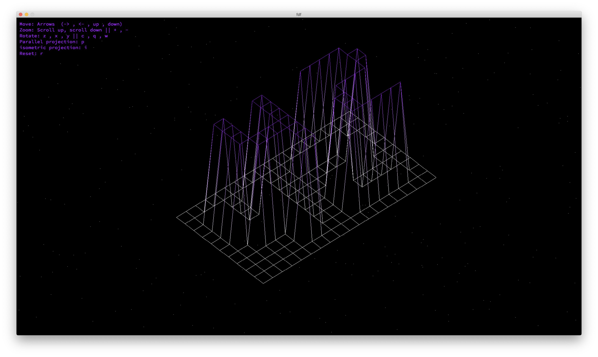
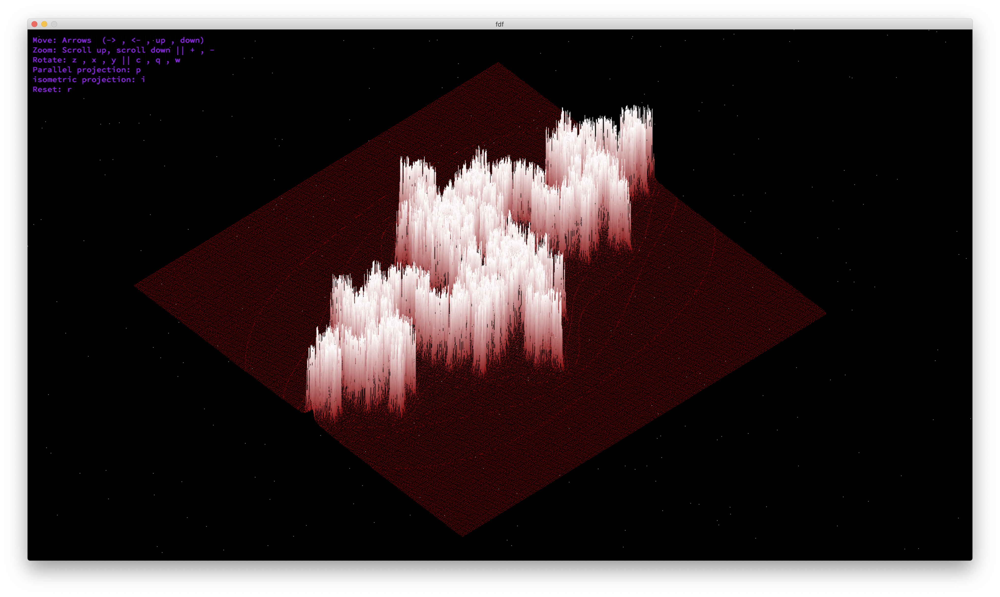
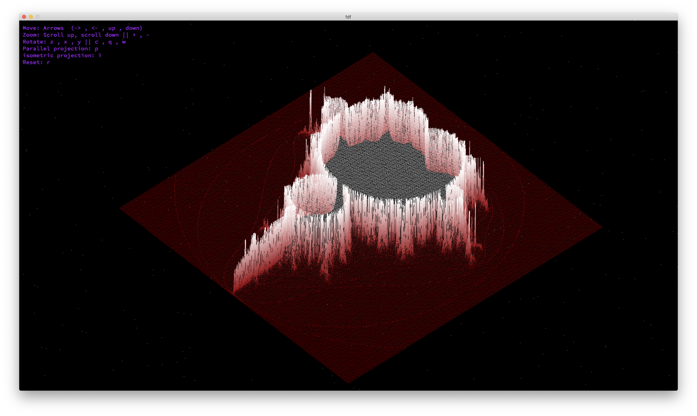

# FDF - 3D Wireframe Viewer



<p align="center">
  
</p>


## Overview

FDF is a simple 3D wireframe viewer designed to render landscapes in the form of heightmaps. It reads input files containing coordinates and displays the corresponding 3D representation using the MiniLibX graphics library.

## Features

- **Simple Interface:** FDF provides an easy-to-use interface for viewing 3D wireframe models.
- **Heightmap Rendering:** Utilizes heightmaps to generate 3D landscapes.
- **Color Gradient:** Supports color gradient mapping for better visualization of terrain.
- **Zoom and Rotation:** Allows users to zoom in/out and rotate the rendered model for better inspection.

## Usage

1. Clone the repository:

```bash
git clone https://github.com/ychbily/FDF.git
``` 
2. Compile the project:
```bash
make
```
or
```bash
make bonus
```
4. Run the program with a provided map file:
```bash
./fdf <map_file>
./fdf_bonus <map_file>
```

## Screenshots




## Contributing
Contributions are welcome! If you find any issues or have suggestions for improvements, feel free to open an issue or create a pull request.

## Acknowledgments

Completed as part of the curriculum at [1337 School](https://1337.ma/) in Khouribga, Morocco, achieving a perfect score of 125/125.
